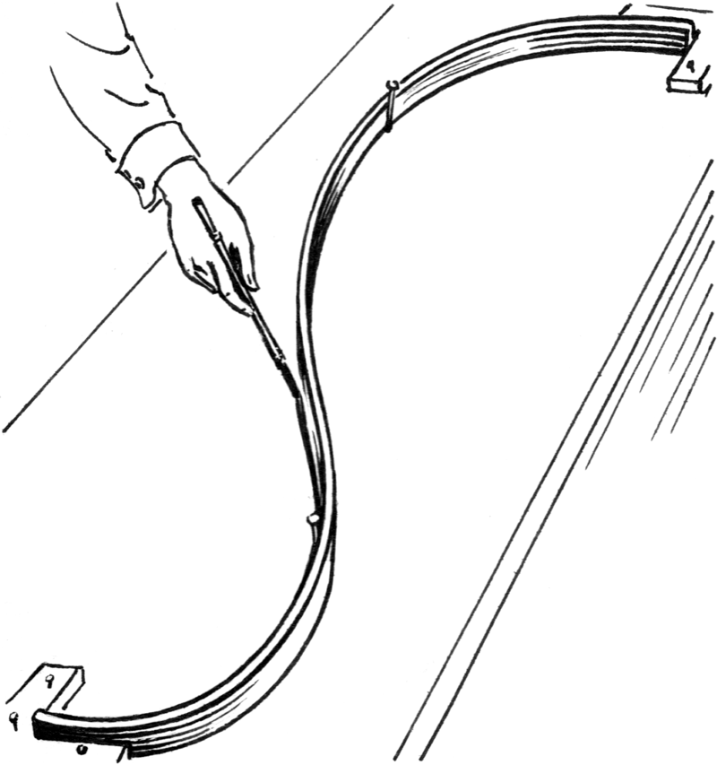
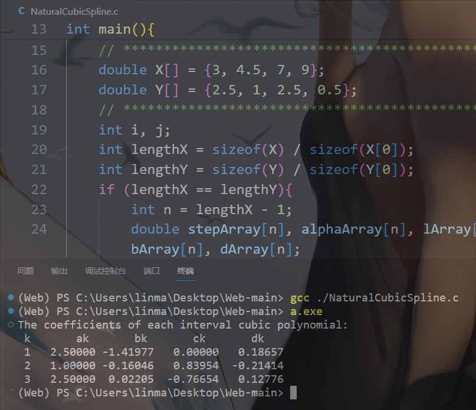
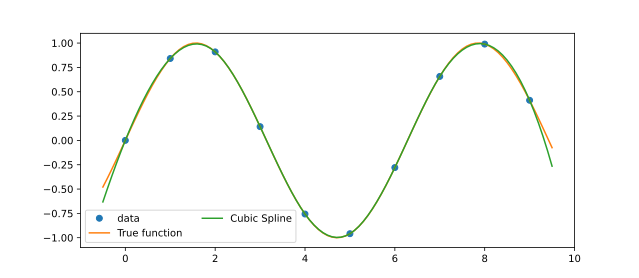

三点三次自然样条插值
======================

|

Ⅰ. 背景 --> Ⅱ. 原理 --> Ⅲ. 示例 --> Ⅳ. C 代码与 Python Scipy 库

|

================
Ⅰ. 背景
================

前面三次埃尔米特插值中，提到了无人车拐弯，要求旋转相等平缓，样条（Spline）源自于工程领域，工人为了用一条平滑的曲线穿过固定的节点，使用弹性的木条自然安置在这些点列上. 如下图所示.

|

================
Ⅱ. 原理
================

对于自变量从小到大排序的点列：

.. math:: \{(x_0,y_0),(x_1,y_1),(x_2,y_2),\ldots,(x_n,y_n)\}

在每个节点区间 :math:`[x_{k-1},x_{k}],\ k=1,2,3,\ldots,n` 内，有不超过三次多项式：

.. math:: \forall x\in[x_{k-1},x_{k}],\ \ s_k(x)=a_k+b_kx+c_kx^2+d_kx^3

定义样条插值多项式：

.. math:: S(x)=\mbox{Combine}\mapsto\bigcup_{k=1}^{n} s_k(x)

这个结合构成的大函数节点处函数值与真实观测值相等，且二阶可导：

.. math:: \forall i,\ S(x_i)=y_i\ \ \& \ \ S(x)\in\mathbb{C}^2[x_0,x_n]

简言之，就是一个每个小区间上都是不超过三次的多项式分段组合构成的大函数，且工程师们希望节点交界处尽量光滑，要求二阶可导. 至于多分段样条插值的原理，公式排版起来极其复杂，参考 USTC 的三弯矩方程求解算法.

http://staff.ustc.edu.cn/~lgliu/Courses/GAMES102_2020/documents/GAMES102-suppl-2-CubicSpline.pdf

这里为了简化数学模型，方便理解，Illusionna 重定义三点三次自然样条插值.

.. math:: (x_0<x_1<x_2)

.. math:: (y_0,\ y_1,\ y_2)

.. math::
    :nowrap:

    \begin{align}
        {\rm Redefine}: S(x)
        =
        \begin{cases}
        s_1(x),\ \ x_0\leqslant x\leqslant x_1
        \\
        s_2(x),\ \ x_1\leqslant x\leqslant x_2
        \notag
        \end{cases}
    \end{align}

其中，小函数 :math:`s_1(x)` 和 :math:`s_2(x)` 都是三次多项式，满足：

.. math:: S(x_i)=y_i,\ \ i=1,2,3,\ \ s_1'(x_1)=s_2'(x_1),\ \ s_1''(x_1)=s_2''(x_1)

这里的“自然”插值，转化成数学语言，即端节点处二阶导数恒为零：

.. math:: s_1''(x_0)=s_2''(x_2)\equiv0

|

================
Ⅲ. 示例
================

引用 :download:`<Burden, Annette and Burden, Richard and Faires, J. Numerical Analysis, 9th ed. (2010)> <./CubicSpline.html>` 的示例点列.

已知三个节点，计算三次自然样条插值多项式【** 类似 Python 的可迭代对象拆包】.

.. math:: \{^{**}(\bm{\vec{x}},\bm{\vec{y}})\}=\{(1,2),(2,3),(3,5)\}

设小函数：

.. math:: s_1(x)=a_1+b_1(x-x_0)+c_1(x-x_0)^2+d_1(x-x_0)^3

.. math:: s_2(x)=a_2+b_2(x-x_1)+c_2(x-x_1)^2+d_2(x-x_1)^3

由于：

.. math:: s_1(x_0)=s_1(1)=2\Longrightarrow a_1=2

.. math:: s_2(x_1)=s_2(2)=3\Longrightarrow a_2=3

.. math:: s_1(2)=3\Longrightarrow a_1+b_1+c_1+d_1=3

.. math:: s_2(3)=5\Longrightarrow a_2+b_2+c_2+d_2=5

消元：

.. math::
    \begin{align}
        \begin{cases}
        b_1+c_1+d_1=1
        \\
        b_2+c_2+d_2=2
        \end{cases}
    \tag{$\ast$}
    \end{align}

又因为：

.. math:: s_1'(x_1)=s_2'(x_1)\ \ \& \ \ s_1''(x_1)=s_2''(x_1)

所以求一阶导数和二阶导数，化简：

.. math::
    \begin{align}
        \begin{cases}
        b_1+2c_1+3d_1=b_2,\ \ {\rm From:}\ s_1'(2)=s_2'(2)
        \\
        c_1+3d_1=c_2,\ \ {\rm From:}\ s_1''(2)=s_2''(2)
        \end{cases}
    \tag{$\star$}
    \end{align}

并且，因为是自然样条插值：

.. math:: s_1''(x_0)=s_2''(x_2)\equiv0

所以：

.. math::
    \begin{align}
        \begin{cases}
        c_1=0,\ \ {\rm From:}\ s_1''(1)=0
        \\
        c_2+3d_2=0,\ \ {\rm From:}\ s_2''(3)=0
        \end{cases}
    \tag{$\divideontimes$}
    \end{align}

联立方程组 (:math:`\ast.`)(:math:`\star.`)(:math:`\divideontimes.`) 整理得到：

.. math::
    \begin{align}
        S(x)=
        \begin{cases}
        \dfrac{1}{4}(x-1)^3+\dfrac{3}{4}(x-1)+2,\ x\in[1,2]
        \\
        -\dfrac{1}{4}(x-2)^3+\dfrac{3}{4}(x-2)^2+\dfrac{3}{2}(x-2)+3,\ x\in[2,3]
        \end{cases}
    \notag
    \end{align}

|

===================================
Ⅳ. C 代码与 Python Scipy 库
===================================

C 代码算法实现原理建议先阅读：

.. centered:: :download:`<Natural Cubic Spline Algorithm> <./NaturalCubicSpline.pdf>`

C 代码只实现求解多分段样条插值多项式系数，并没有插值函数，若有需要自行补充.

.. code-block:: C
    :caption: NaturalCubicSpline.c
    :emphasize-lines: 11,16,17
    :linenos:

    /*
    System --> Linux & gcc8.1.0
    File ----> NaturalCubicSpline.c
    Author --> Illusionna
    Create --> 2024/2/21 22:16:30
    '''
    -*- Encoding: UTF-8 -*-
    */

    # include <stdio.h>

    int main(){
        printf("\033[H\033[J");
        // ********************************************************
        double X[] = {3, 4.5, 7, 9};
        double Y[] = {2.5, 1, 2.5, 0.5};
        // ********************************************************
        int i, j;
        int lengthX = sizeof(X) / sizeof(X[0]);
        int lengthY = sizeof(Y) / sizeof(Y[0]);
        if (lengthX == lengthY){
            int n = lengthX - 1;
            double stepArray[n], alphaArray[n], lArray[n+1], muArray[n+1], zArray[n+1], cArray[n+1], bArray[n], dArray[n];
            // Step 1.
            for (i=0; i<n; ++i){
                stepArray[i] = X[i+1] - X[i];
            }
            // Step 2.
            for (i=1; i<n; ++i){
                alphaArray[i] = (3 * (Y[i+1] - Y[i]) / stepArray[i]) - (3 * (Y[i] - Y[i-1]) / stepArray[i-1]);
            }
            // Step 3.
            lArray[0] = 1;
            muArray[0] = 0;
            zArray[0] = 0;
            // Step 4.
            for (i=1; i<n; ++i){
                lArray[i] = 2 * (X[i+1] - X[i-1]) - stepArray[i-1] * muArray[i-1];
                muArray[i] = stepArray[i] / lArray[i];
                zArray[i] = (alphaArray[i] - stepArray[i-1] * zArray[i-1]) / lArray[i];
            }
            // Step 5.
            lArray[n] = 1;
            zArray[n] = 0;
            cArray[n] = 0;
            // Step 6.
            for (j=n-1; j>=0; --j){
                cArray[j] = zArray[j] - muArray[j] * cArray[j+1];
                bArray[j] = ((Y[j+1] - Y[j]) / stepArray[j]) - (stepArray[j] * (cArray[j+1] + 2 * cArray[j]) / 3);
                dArray[j] = (cArray[j+1] - cArray[j]) / (3 * stepArray[j]);
            }
            // Information.
            printf("The coefficients of each interval cubic polynomial:\n");
            printf("%2s %8s %8s %8s %8s\n", "k", "ak", "bk", "ck", "dk");
            for (i=0; i<n; ++i){
                printf("%2d %9.5f %8.5f %9.5f %9.5f\n", i+1, Y[i], bArray[i], cArray[i], dArray[i]);
            }
        }
        else{
            // Warning...
            printf("\033[31mError\033[0m: length of X is\033[31m %d\033[0m, but length of Y is\033[31m %d\033[0m.\n", lengthX, lengthY);
            printf("\033[33mCheck array!\033[0m");
        }
        return 0;
    }

|

.. code-block:: Python
    :caption: NaturalCubicSpline.py
    :linenos:

    import numpy as np
    import matplotlib.pyplot as plt
    from scipy.interpolate import CubicSpline

    X = np.arange(10)
    Y = np.sin(X)
    cs = CubicSpline(X, Y)
    xs = np.arange(-0.5, 9.6, 0.1)

    (fig, ax) = plt.subplots(figsize=(6.5, 4))
    ax.plot(X, Y, 'o', label='data')
    ax.plot(xs, np.sin(xs), label='True function')
    ax.plot(xs, cs(xs), label="Cubic Spline")
    ax.legend(loc='lower left', ncol=2)
    plt.show()

|