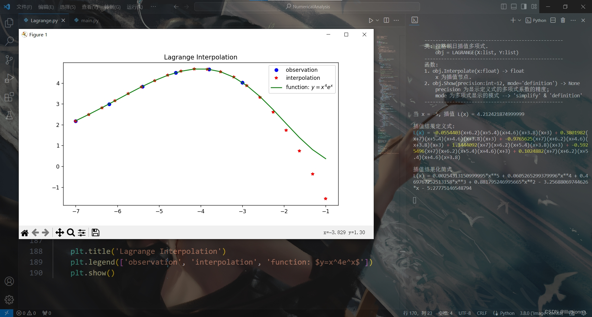

拉格朗日插值
================

|

Ⅰ. 作用 --> Ⅱ. 原理 --> Ⅲ. 余项 --> Ⅳ. 示例 --> Ⅴ. Python 代码 --> Ⅵ. 背景

|

================
Ⅰ. 作用
================

顾名思义，既然是插值，那就可以补充数据，在旧数据之间插入新值. 拉格朗日插值得到的多项式当然也可用于预测，但我强烈不建议你去预测那些遥远的节点，一来，变数太大不够准确，二来，插值构造的多项式阶数过高，他们说，这会产生龙格现象.

|

================
Ⅱ. 原理
================

已知从小到大排序的唯一点列，统计上亦称“观测”，observation：

.. math:: \overrightarrow{X}=[x_1,x_2,\dots,x_n]^{\top}

.. math:: \overrightarrow{Y}=[y_1,y_2,\dots,y_n]^{\top}

定义拉格朗日插值基函数：

:math:`\forall t\in\{1,2,\dots,n\},\ \ \ \ l_{t}(x)=\dfrac{\prod\limits_{i=1}^{n\setminus t}(x-x_{i})}{\prod\limits_{i=1}^{n\setminus t}(x_t-x_{i})}`

定义拉格朗日插值多项式：

.. math::
    :nowrap:
    
    \begin{gather*}
    L(x)=\sum\limits_{t=1}^{n}y_tl_{t}(x)
    \end{gather*}

阶数：

:math:`\partial l_{t}(x)=n-1,\ \ \ \ \partial L(x)=n-1`

新的插值节点：

:math:`x^{*}\Longrightarrow y^{*}=L(x^{*})`

|

================
Ⅲ. 余项
================

插值多项式毕竟不是本源函数（一般现实里本源函数也是未知），因此，拉格朗日插值多项式就存在误差，亦称余项.

假定人类已知性质良好的本源函数：

.. math:: y=f(x)

则，拉格朗日插值多项式余项（截断误差）为：

.. math:: \{x_1,x_2,\dots,x_n\}\subseteq[a,b]\ \ \ \&\ \ \ \forall k,\ x_k<x_{k+1},\ y_k=f(x_k)

.. math:: {\rm Residual}(x)=f(x)-L(x)=\dfrac{f^{n}(\xi)}{n!}\times\prod\limits_{i=1}^{n}(x-x_i),\ \ \ \xi\in(a,b)

|

================
Ⅳ. 示例
================

已知观测：

:math:`\overrightarrow{X}=[1,2,3]^{\top}`

:math:`\overrightarrow{Y}=[1,-4,9]^{\top}`

则二次拉格朗日插值多项式为：

.. math::
    L(x) &= 1\times\dfrac{(x-2)(x-3)}{(1-2)(1-3)}-4\times\dfrac{(x-1)(x-3)}{(2-1)(2-3)}
    \\
    &+ 9\times\dfrac{(x-1)(x-2)}{(3-1)(3-2)}

插值：

:math:`x^{*}=1.5`

:math:`y^{*}=L(x^{*})=-3.75`

预测遥远的节点：

:math:`x^{*}=12`

:math:`y^{*}=L(x^{*})=936`

注意到，由已知点列构造的拉格朗日插值多项式，对于新的插值节点 12，距离自变量 1, 2, 3 整体较远，代入得到的函数值 936 非常大. 用插值多项式预测遥远的节点，变数极大，结果是不稳定的.

|

================
Ⅴ. 代码
================

.. code-block:: python
    :caption: Lagrange.py
    :emphasize-lines: 10,11,12,13,161,162,163,164
    :linenos:

    '''
    # System --> Windows & Python3.8.0
    # File ----> Lagrange.py
    # Author --> Illusionna
    # Create --> 2023/11/02 15:53:15
    '''
    # -*- Encoding: UTF-8 -*-

    import copy
    import numpy as np
    from typing import Literal
    from sympy import (symbols, expand)

    class LAGRANGE:
        """
        --------------------------------------------------
        类: 拉格朗日插值多项式.
            obj = LAGRANGE(X:list, Y:list)
        --------------------------------------------------
        函数:
        1. obj.Interpolate(x:float) -> float
            x 为插值节点.
        2. obj.Show(precision:int=12, mode='definition') -> None
            precision 为显示定义式的多项式系数的精度;
            mode 为多项式显示的模式 --> 'simplify' & 'definition'
        --------------------------------------------------
        """
        def __init__(
            self,
            *args,
            X:list,
            Y:list,
            **kwargs
        ) -> None:
            self.X = X
            self.Y = Y
            self.__base = LAGRANGE.__BaseCoefficients(self)

        def Interpolate(self, x:float) -> float:
            """
            拉格朗日插值.
            """
            result = 0
            val = x
            for i in range(0, len(self.X), 1):
                temp = list(
                    map(lambda x: val - x, self.X)
                )
                temp.pop(i)
                numerator = np.array(temp).prod()
                del temp
                # --------------------------------------
                """
                如果想获取更精确的插值，解锁如下注释...
                """
                # temp = list(
                #     map(lambda x: self.X[i] - x, self.X)
                # )
                # temp.remove(0)
                # denominator = np.array(temp).prod()
                # del temp
                """
                用如下注释顶替 result 输出结果...
                """
                # result = result + (self.Y[i] * numerator / denominator)
                # --------------------------------------
                result = result + self.__base[i]*numerator
            return result

        def Show(
            self,
            precision:int=12,
            mode:Literal['definition', 'simplify']='definition'
        ) -> None:
            """
            控制台显示拉格朗日多项式.
            """
            if mode == 'definition':
                showString = '\033[036mL(x)\033[0m = '
                for i in range(0, len(self.__base), 1):
                    coef = self.__base[i]
                    string = LAGRANGE.__PolynomialString(self.X, i, 'definition')
                    temp = f'\033[033m%.{precision}f\033[0m{string} \033[031m+\033[0m ' % coef
                    showString = showString + temp
                showString = showString[:-13]
                del temp
                print(showString)
            elif mode == 'simplify':
                showString = ''
                for i in range(0, len(self.__base), 1):
                    coef = self.__base[i]
                    string = LAGRANGE.__PolynomialString(self.X, i, 'simplify')
                    string = string[:-1]
                    temp = f'%.{precision}f*{string}+' % coef
                    showString = showString + temp
                showString = showString[:-1]
                temp = str(expand(showString))
                expression= 'L(x) = '
                expression = expression + temp
                del temp
                print(expression)
            else:
                print('Error...')
                exit(0)

        def __BaseCoefficients(self) -> list:
            coefficientsVector = []
            for i in range(0, len(self.Y), 1):
                y = self.Y[i]
                temp = list(
                    map(lambda x: self.X[i] - x, self.X)
                )
                temp.remove(0)
                denominator = np.array(temp).prod()
                coefficientsVector.append(y / denominator)
            del temp
            return coefficientsVector

        def __PolynomialString(vector:list, i:int, mode:str) -> str:
            temp = copy.deepcopy(vector)
            temp.pop(i)
            string = ''
            if mode == 'definition':
                for j in range(0, len(temp), 1):
                    value = temp[j]
                    if value > 0:
                        string = string + f'(x-{value})'
                    elif value < 0:
                        string = string + f'(x+{abs(value)})'
                    elif value == 0:
                        string = string + '(x)'
                del temp
                return string
            else:
                for j in range(0, len(temp), 1):
                    value = temp[j]
                    if value > 0:
                        string = string + f'(x-{value})*'
                    elif value < 0:
                        string = string + f'(x+{abs(value)})*'
                    elif value == 0:
                        string = string + '(x-0)*'
                del temp
                return string

    
    if __name__ == '__main__':
        """
        以 y = (x^4)*(e^x) 为例.
        查看 LAGRANGE 类文档
        >>> print(LAGRANGE.__doc__)
        """
        # 测试拉格朗日插值类效果.
        print('\033[H\033[J', end='')
        print(LAGRANGE.__doc__)

        # ----------------------------------------
        # 插值核心代码.
        X = [-7, -6.2, -5.4, -4.6, -3.8, -3]
        Y = [2.18, 2.99, 3.84, 4.50, 4.66, 4.03]
        obj = LAGRANGE(X=X, Y=Y)
        value = obj.Interpolate(-5)
        # ----------------------------------------

        print(f'当 x = -5, 插值 L(x) = {value}')
        print('\n插值结果定义式:')
        obj.Show(precision=7, mode='definition')
        print('\n插值结果化简式')
        obj.Show(mode='simplify')
        print('')

        # ----------------------------------------

        import matplotlib.pyplot as plt

        x = np.linspace(-7, -1, 20)
        y1 = x**4 * np.exp(x)
        y2 = []
        for i in range(0, len(x), 1):
            y2.append(obj.Interpolate(x[i]))

        observation = plt.plot(X, Y, 'bo')
        interpolation = plt.plot(x, y2, 'r*')
        function = plt.plot(x, y1, 'g-')

        plt.title('Lagrange Interpolation')
        plt.legend(['observation', 'interpolation', 'function: $y=x^4e^x$'])
        plt.show()

|

插值结果：

|

================
Ⅵ. 背景
================

+--------------------+
|【背景根据历史虚构】|
+--------------------+

在 16 世纪，由于欧洲航海事业的发展，先驱们就必须掌握“观天象”这一本领，自然就离不开天文学的引导.

十七世纪新纪元的伊始之年，步 Giordano Bruno 火刑之后尘，欧洲的人们逐渐接受《日心说》思想.

假设在 17 世纪，人类通过某些特殊手段获取到太阳和地球的部分数据，包括距离和引力，但由于马虎，忘了记载数量级、量纲单位 :)>

.. list-table:: 先驱们留下的资料
    :widths: 25 25
    :header-rows: 1

    * - 距离（Distance）
      - 引力（Gravity）
    * - 1.46
      - 3.7160276576
    * - 1.47
      - 3.6656414249
    * - 1.48
      - 3.6162730803
    * - 1.50
      - 3.5204820244
    * - 1.51
      - 3.4740075238
    * - 1.52
      - 3.4284472624

人们知道一年有 365 天、四个季度，地球围绕太阳椭圆公转，因此，地日距离自然不同，表格中六个观测的距离是地表最强肉眼观察大师第谷所得，（六个引力值是未来的笔者我所提供）.

某一天，第谷又观察到一个新的地日距离 1.49 无单位，人们想知道当天的引力值，但未来的我因网络信号不佳，提供的引力值传输到数据链路层被吃掉了.

焦头烂额之际，主人公 Joseph-Louis Lagrange 粉墨登场，说：“我会”，于是他创造性地给出拉格朗日插值法，熟练 Lagrange.py 代码，在 1.48 和 1.50 之间插入 1.49 的函数值，终端返回：

.. math:: 3.5678953899295365

至此，人们的问题得以解决.

但不久之后，质疑的声音在人群中嘹响. 譬如，未来的我，我觉得拉格朗日的结果不一定对，他方法得到的结果应该有很大偏差. 所以，这个偏差究竟该怎么断定？

这个时候，我们就需要这六个观察对应的本源函数，用绝对真值和估计插值比对，看看误差大小是否在我们可控范围之内.

纵使世间万象万千，好在稍后的牛顿发现了现象背后的本源函数，即万有引力定律：

.. math::
    :nowrap:
    
    \begin{gather*}
    F=\dfrac{GM_1M_2}{r^2}\Longrightarrow {\rm Gravity(Distance)}=\dfrac{GM_1M_2}{{\rm Distance}^2}=\dfrac{k}{r^2}
    \end{gather*}

通过表格已知的数据，把分子作为整体消去后，我们得到距离为 1.49 时的万有引力：

.. math:: 3.5678953898473048

通过本源函数计算的引力值和拉格朗日插值得到的引力值，一直到小数点后 10 位才发生分歧（不同电子设备计算的值可能略有不同，此处只表意），面对如此穷极至小的误差，我拜倒在拉格朗日的膝底.

从此，笔者我质疑的声音消失了.

当然，消去分子整体后，重新确定万有引力函数的常数项系数，上述过程，通过拉格朗日插值多项式余项估算也可以的：

.. math:: {\rm Residual}(1.49)=F(1.49)-L(1.49)=\dfrac{\dfrac{\partial^6 F}{\partial r}\bigg|_{r=\xi}}{720}\times\prod\limits_{i=1}^{6}(1.49-r_i),\ \ \ \xi\in(1.46,1.52)

|