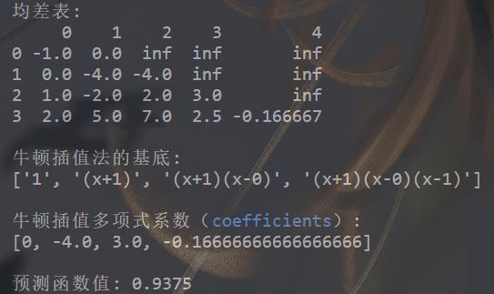

牛顿插值
================

|

Ⅰ. 作用 --> Ⅱ. 原理 --> Ⅲ. 余项 --> Ⅳ. 示例 --> Ⅴ. Python 代码

|

================
Ⅰ. 作用
================

牛顿插值是根据已知点列，构造插值多项式，用多项式预测新节点的函数值. 这和拉格朗日插值作用一致，但牛顿插值可以避免拉氏插值的一个弊端：拉格朗日插值节点增加或减少，拉格朗日多项式需要全部重新计算，虽然对计算机而言无所畏惧，但肯定还是不便的，会带来资源开销，牛顿插值能够解决这种增减带来全部计算的现象. 牛顿插值和拉格朗日插值本质上都是多项式插值法，牛顿插值法与拉格朗日插值法相比具有承袭性和易于变动的特点【继承和易变，后面示例部分可以体悟】.

|

================
Ⅱ. 原理
================

USTC 的幻灯片更详尽地阐述牛顿插值法.

.. raw:: html

    <iframe
        src = "http://staff.ustc.edu.cn/~rui/ppt/num/num-interpolation-newton.html"
        title = "iframe Example 1"
        width = "640"
        height = "300"
    ></iframe>

已知一系列从小到大排序（自变量排序而非因变量）互不相同的 :math:`n+1` 个节点：

.. math:: (x_0, x_1, \ldots, x_n)

.. math:: (y_0, y_1, \ldots, y_n)

定义牛顿插值多项式：

.. math:: N(x)=k_0\times1+k_1(x-x_0)+k_2(x-x_0)(x-x_1)+\cdots+k_n(x-x_0)(x-x_1)\cdots(x-x_{n-1})

阶数： :math:`\partial N(x)=n`.

多项式系数，即均差：

.. math::
    :nowrap:

    \begin{align}
        \begin{cases}
        k_0=f[x_0]=y_0
        \\
        k_1=f[x_0,x_1]=\dfrac{y_1-y_0}{x_1-x_0}
        \\
        k_2=f[x_0,x_1,x_2]=\dfrac{f[x_1,x_2]-f[x_0,x_1]}{x_2-x_0}=\dfrac{\dfrac{y_2-y_1}{x_2-x_1}-\dfrac{y_1-y_0}{x_1-x_0}}{x_2-x_1+x_1-x_0}
        \\
        \ \ \ \ \ \vdots
        \\
        k_n=f[x_0,x_1,\ldots,x_n]=\displaystyle\sum\limits_{i=0}^{n}\dfrac{y_i}{\displaystyle\prod\limits_{t=0}^{n\setminus i}(x_i-x_t)}
        \\
        \prod\limits_{t=0}^{n\setminus i}(x_i-x_t)=(x_i-x_0)(x_i-x_1)\cdots(x_i-x_{i-1})(x_i-x_{i+1})(x_i-x_{i+2})\cdots(x_i-x_n)
        \end{cases}
        \notag
    \end{align}

|

================
Ⅲ. 余项
================

牛顿插值的误差本质上同拉格朗日插值余项：

.. math:: {\rm Residual}(x)=f[\bm{x},x_0,x_1,\ldots,x_n]\prod\limits_{t=0}^{n}(x-x_t)=\dfrac{f^{(n+1)}(\xi)}{(n+1)!}\prod\limits_{t=0}^{n}(x-x_t)

.. math:: \xi\in(\min\{x,x_0\}, \max\{x,x_n\})

可以把 :math:`x` 看作 :math:`x_{n+1}` 处理, 由于均差具有任意交换性：

.. math:: f[\bm{x},x_0,x_1,\ldots,x_n]=f[x_0,x_1,\ldots,x_n,x_{n+1}]=k_{n+1}

那么，因为 :math:`x` 是自变量，所以，:math:`x_0,x_1,\ldots,x_n` 要看作已知点列，:math:`x_{n+1}` 看作自变量.

|

================
Ⅳ. 示例
================

为了计算牛顿插值多项式各系数，列出包含所有系数的均差表，无论从手动笔算角度还是计算机运算角度，都是明智的抉择.

.. list-table:: 均差表
  :widths: 2 2 3 4 5 6
  :header-rows: 1

  * - x
    - y
    - 一阶
    - 二阶
    - 三阶
    - 四阶
  * - :math:`x_0`
    - :math:`y_0`
    -
    -
    -
    -
  * - :math:`x_1`
    - :math:`y_1`
    - :math:`f[x_0,x_1]`
    -
    -
    -
  * - :math:`x_2`
    - :math:`y_2`
    - :math:`f[x_1,x_2]`
    - :math:`f[x_0,x_1,x_2]`
    -
    -
  * - :math:`x_3`
    - :math:`y_3`
    - :math:`f[x_2,x_3]`
    - :math:`f[x_1,x_2,x_3]`
    - :math:`f[x_0,x_1,x_2,x_3]`
    -
  * - :math:`x_4`
    - :math:`y_4`
    - :math:`f[x_3,x_4]`
    - :math:`f[x_2,x_3,x_4]`
    - :math:`f[x_1,x_2,x_3,x_4]`
    - :math:`f[x_0,x_1,x_2,x_3,x_4]`
  * - :math:`\cdots`
    - :math:`\cdots`
    - :math:`\cdots`
    - :math:`\cdots\cdots`
    - :math:`\cdots\cdots`
    - :math:`\cdots\cdots`

我们需要的系数就是均差表主对角线元素.

计算已知点列的牛顿插值法在 :math:`x=1.5` 处的函数值：

:math:`\vec{x}=(-1, 0, 1, 2)`

:math:`\vec{y}=(0, -4, -2, 5)`

.. list-table:: 示例均差表
  :widths: 2 2 5 5 6
  :header-rows: 1

  * - x
    - y
    - 一阶
    - 二阶
    - 三阶
  * - :math:`-1`
    - :math:`0`
    -
    -
    -
  * - :math:`0`
    - :math:`-4`
    - (-4-0)/[0-(-1)]=-4
    -
    -
  * - :math:`1`
    - :math:`-2`
    - [-2-(-4)]/(1-0)=2
    - [2-(-4)]/[1-(-1)]=3
    -
  * - :math:`2`
    - :math:`5`
    - [5-(-2)]/(2-1)=7
    - (7-2)/(2-0)=2.5
    - (2.5-3)/[2-(-1)]=-1/6

则三次牛顿插值多项式为：

.. math:: N_3(x)=0-4[x-(-1)]+3[x-(-1)](x-0)-\dfrac{1}{6}[x-(-1)](x-0)(x-1)

:math:`N_3(1.5)=0.9375`

继承和易变是牛顿插值法的特点，牛顿插值多项式的基底是：

.. math:: \{1,(x-x_0),(x-x_0)(x-x_1),\ldots,(x-x_0)(x-x_1)\cdots(x-x_{n-1})\}

当每次增加（或减少）一个节点，只需要补充（或删除）一个均差系数与基底的乘积项即可，不必大动干戈重新计算多项式，这就是牛顿插值相比于拉格朗日插值的一个改进.

|

================
Ⅴ. 代码
================

.. code-block:: python
    :caption: NewtonInterpolation.py
    :emphasize-lines: 10,11
    :linenos:

    '''
    # System --> Windows & Python3.8.0
    # File ----> NewtonInterpolation.py
    # Author --> Illusionna
    # Create --> 2024/2/15 23:28:36
    '''
    # -*- Encoding: UTF-8 -*-

    import numpy as np
    import pandas as pd

    class NEWTON_INTERPOLATION:
        """
        牛顿插值类.
        """
        def __init__(self, *args, X:list, Y:list, **kwargs) -> None:
            """
            初始化构造函数: 传入已知点列.
            """
            self.__X = X
            self.__Y = Y
            self.coefficients = [Y[0]]
            if ((len(self.__X) <= 1) | (len(self.__Y) <= 1)) | (len(self.__X) != len(self.__Y)):
                assert print(f'输入点列\033[31m X 长度: {len(self.__X)}, Y 长度: {len(self.__Y)},\033[0m 已知点列数量过短或长度不一致.')
            self.__Create()

        def CalculateDividedDifferences(self) -> None:
            """
            公有函数: 计算均差表.
            """
            pos = 1
            for i in range(0, len(self.__X)-1, 1):
                for j in range(0, len(self.__Y)-1, 1):
                    x = self.__X[j+pos] - self.__X[j]
                    y = self.__Y[j+1] - self.__Y[j]
                    self.__Y.append(y/x)
                    self.__dividedDifferencesTable[j+pos][i+2] = y/x
                del self.__Y[:(len(self.__X)-i)]
                pos = -~pos
                self.coefficients.append(self.__Y[0])

        def __Create(self) -> None:
            """
            私有函数: 创建初始化的均差表.
            """
            self.__dividedDifferencesTable = np.ones([len(self.__X), len(self.__X)+1]) * np.inf
            tmp = np.array([self.__X]).T
            self.__dividedDifferencesTable[:,[0]] = tmp
            tmp = np.array([self.__Y]).T
            self.__dividedDifferencesTable[:,[1]] = tmp
        
        def __Base(self) -> None:
            """
            私有函数: 生成多项式基底.
            """
            self.base = ['1']
            for i in range(0, len(self.__X), 1):
                value = ''
                for j in range(0, i, 1):
                    if self.__X[j] >= 0:
                        tmp = f'(x-{self.__X[j]})'
                    else:
                        tmp = f'(x+{-self.__X[j]})'
                    value = value + tmp
                if len(value) != 0:
                    self.base.append(value)

        def Interpolate(self, x:float) -> float:
            """
            公有函数: 牛顿插值, 输入插值节点, 返回插值.
            """
            result = 1*self.coefficients[0]
            tmp = 1
            for index in range(0, len(self.__X)-1, 1):
                value = x - self.__X[index]
                tmp = tmp * value
                result = result + tmp * self.coefficients[index+1]
            return result        

        def Information(self) -> None:
            """
            公有函数: 打印信息.
            """
            self.__Base()
            if len(self.coefficients) <= 12:
                tmp = pd.DataFrame(self.__dividedDifferencesTable)
                print(f'均差表:\n{tmp}\n')
                print(f'牛顿插值法的基底:\n{self.base}\n')
                print(f'牛顿插值多项式系数（\033[34mcoefficients\033[0m）:\n{self.coefficients}\n')
            else:
                print(f'\033[33m均差表维度 {self.__dividedDifferencesTable.shape[0]}x{self.__dividedDifferencesTable.shape[1]} 过大, 不易打印.\033[0m')
                print(f'牛顿插值法的基底:\n{self.base}\n')
                print(f'牛顿插值多项式系数（\033[34mcoefficients\033[0m）:\n{self.coefficients}\n')
              

    if __name__ == '__main__':
        X = [-1, 0, 1, 2]
        Y = [0, -4, -2, 5]

        obj = NEWTON_INTERPOLATION(X=X, Y=Y)
        obj.CalculateDividedDifferences()
        obj.Information()
        print(f'预测函数值: {obj.Interpolate(x=1.5)}')

|

插值结果：

