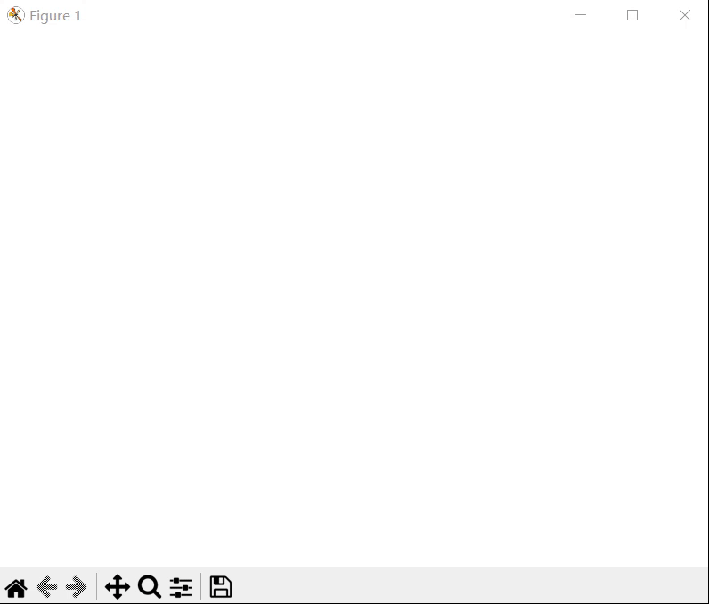

龙格现象
================

|

Ⅰ. 背景 --> Ⅱ. 示例 --> Ⅲ. Python 代码

|

================
Ⅰ. 背景
================

对于某些本源函数，一般情况，如果已知的数据点列越多，构造出的插值多项式阶数越高，预测的函数值相对也会越准确. 但在插值区间的边缘，误差可能会超乎人类想象. 边缘剧烈的震荡带来的巨大的误差，数学家们称之为 Runge Phenomenon，龙格现象.

|

================
Ⅱ. 示例
================

以拉格朗日插值多项式为例，本源函数选取“龙格函数”，观察如下 .gif 动画结果：

.. math:: {\rm Runge}(x)=\dfrac{1}{1+25x^2},\ \ \ \ x\in[-1,1]

|

观察到，随着拉格朗日插值多项式阶数的增高，插值区间边缘的函数值跳动剧烈，并且这种震荡不断的现象似乎有着向原点逼近的趋势.

这种用高阶多项式插值带来的边缘函数值剧烈震荡（Oscillate violently），最先由德国数学家 Carl Runge 发现，因此，翻译为“龙格现象”.

|

================
Ⅲ. Python 代码
================

Runge.py 代码调用的 LAGRANGE 自定义类见：

.. list-table::
    :widths: 25
    :header-rows: 0

    * - :doc:`../拉格朗日插值/Lagrange`

.. code-block:: python
    :caption: Runge.py
    :emphasize-lines: 2,22,29
    :linenos:

    import matplotlib.pyplot as plt
    from Lagrange import LAGRANGE

    def Chart() -> None:
        plt.ion()
        for order in range(2, 50+2, 1):
            plt.cla()
            plt.axis([-2.5, 2.5, -3, 3])

            X = np.linspace(-1, 1, 300)
            Y = list(
                map(lambda x: 1 / (1 + 25 * (x * x)), X)
            )
            plt.plot(X, Y, 'r-.')
            del X
            del Y

            X = np.linspace(-1, 1, order)
            Y = list(
                map(lambda x: 1 / (1 + 25 * (x * x)), X)
            )
            obj = LAGRANGE(X=X.tolist(), Y=Y)
            del X
            del Y
        
            X = np.linspace(-1, 1, 500)
            prediction = []
            for i in range(0, len(X), 1):
                prediction.append(obj.Interpolate(X[i]))
            plt.plot(X, prediction, 'b-', linewidth=0.5)
            del X

            plt.title(f'The Order of Lagrange Interpolation: {order-1}')
            plt.legend(['Runge', 'Lagrange'])
            plt.pause(0.2)
        plt.ioff()
        plt.show()

    Chart()

|